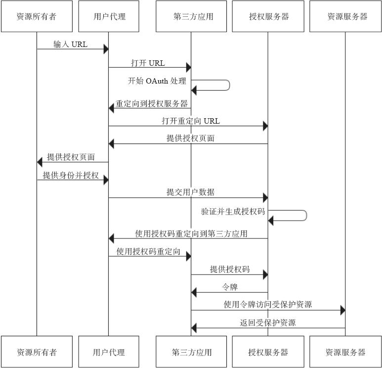

# Rest 安全
>Rest 提供了统一接口和资源定位，简化了WEB服务接口的设计和实现，降低了WEB的复杂度。于此同时，易于识别和理解的Rest接口也潜在着易于被攻击的危险^[1]^

## AAA

## **什么是AAA**

AAA 是指认证（Authentication），授权（Authorization)，计费(Accounting)；

	1. 认证即系统识别访问者身份的过程
	2. 授权即用于限制用户可以执行什么操作，可以访问什么服务。
	3. 记录认证和授权的行为

### 认证
**认证方式**

1. HTTP Basic （基本认证）
2. HTTP Digest（摘要认证
3. 表单认证
4. 证书认证


#### **HTTP Basic （基本认证）**

由HTTP规范中提供，在请求发送前，将用户名和密码，以冒号分隔`userName:password`的形式加密为Base64进行编码
在书中将的比较简略，参照[一文读懂HTTP Basic身份认证](https://juejin.im/entry/5ac175baf265da239e4e3999)博客中所讲，

>Basic认证通过核对用户名、密码的方式，来实现用户身份的验证。

>Basic认证中，最关键的3个要素：

>userid：用户的id。也就是我们常说的用户名。
>password：用户密码。
>realm：“领域”，其实就是指当前认证的保护范围。


***一个基本的认证过程：***

1. 访问一个受限的资源 http://test/example

2. 服务器返回

    ```http
    HTTP/1.1 401 Unauthorized
    WWW-Authenticate: Basic realm=protected_docs

    ```
    响应首部中，通过WWW-Authenticate告知客户端，认证的方案是basic。同时以realm告知认证的范围。

	```http
    WWW-Authenticate: Basic realm=<需要保护资源的范围>
    ```
3. 用户发送认证请求

	用户收到服务端响应后，填写用户名、密码，然后向服务端发送认证请求。(浏览器会自带类似于alert 样式的弹窗供用户输入用户名和密码)


#### **HTTP Digest（摘要认证）**

引入了一系列的安全增强项，有效防止了通信过程中的明文攻击，和基本认证一样的，遵循请求过程中的质询/回应


#### **表单认证**

基于HTTP协议，使用HTML的Form标签提交表单的认证形式。即我们通常使用的登录页面的形式

#### **证书认证**

证书认证是通过数字证书认证身份的方式。一个简单的例子，客户端获取服务颁发的证书，证书中包含服务端的公钥，使用公钥加密要发送的内容，服务端通过私钥进行数据的解密。为了解决其中端点认证的问题引客户端和服务端所持有的证书需要一个最权威的认证机构来颁发。这样就产生了HTTPS，HTTPS即运行在SSL协议之上的HTTP


### 授权

**容器权限**
java 平台的Servlet 和javaEE标准中都提供了权限和认证的实现。实现了相应标准的容器也会有权限部分的实现，供使用者进行权限的配置。一般的开发中很少用到

**应用管理权限**

应用自身对权限管理的实现。

1.  其中JSR250规范提供了安全访问的注解。应用代码通过使用安全访问注解对资源路径进行定义，实现权限管理
2.  JAX-RS2规范定义了一个安全上下文的接口。通过实现接口可以在运行时获取用户信息，从而通过编码的方式，动态的为当前用户提供资源访问的权限。
2. spring security模块。 Spring Security 就是一个Spring生态中关于安全方面的框架。它能够为基于Spring的应用提供声明式的安全访问控制解决方案。

# REST服务与OAuth 2.0
OAuth2是一种授权协议。目前很多大的网络公司都有在使用，例如 GITHUB，GOOGLE ，FACEBOOK，其中github ，国内的公司其中微信公众号小程序等的开发使用的就是Oauth2的形式。


>**角色**^[2]^
> 1. 资源所有者（Resource Owner） ：访问资源受限的实体，也是被授权的实体
> 2. 用户代理（User Agent) : 浏览器
> 3. 第三方应用（Client Application） ：以资源所有者的行为向资源服务器发起请求的应引起，是Oauth2的客户端。
> 4. 资源服务器（Resour Server） ： 受限资源的持有者
> 5. 授权服务器（Authorization server） ：为第三方订阅令牌（access_token),包括短生命周期令牌，和长生命周期令牌。
>
> **授权模式**
> 1.	授权码模式(Authorization Code)：最完整最严格的模式，用于web端
> 2.	简化模式(Implicit)：不通过第三方应用程序的服务器，直接在浏览器中向认证服务器申请令牌，跳过了“授权码”步骤。用于移动应用。
> 3.	密码模式(Resource Owner Password Credentials)：用户向客户端提供自己的用户名和密码。客户端使用这些信息，向服端索要授权。
> 4.	客户端模式(Client Credentials)：客户端以自己的名义，而不是客户的名义，向服务提供商进行认证。


**带入实际的例子中：**

假使我们的云录播资源对外进行开放，使用Oauth2协议进行授权，有开发商基于我们的云录播，做了个第三方的点评系统，此时用户登录第三方的点评系统，将指定的资源发布出去供其他人进行点评。

1. 资源持有者：就是我们的用户即为资源的持有者。
2. 用户代理：浏览器
3. 第三方应用： 此时的第三方应用将指代的是第三方的点评系统。
4. 资源服务器：即我们存放用户拥有的视频的服务器。它与认证服务器，可以是同一台服务器，也可以是不同的服务器。
5. 授权服务器：认证服务器，即服务提供商专门用来处理认证的服务器。


**授权码模式流程**




**接着上面的例子**

1. 用户打开点三方的点评系统后，第三方点评系统要去用户授予权限（重定向到授权服务器）。

2. 用户同意给予客户端授权。

3. 客户端使用上一步获得的授权，向认证服务器申请令牌。

4. 认证服务器对客户端进行认证以后，确认无误，同意发放令牌。

5. 客户端使用令牌，向资源服务器申请获取资源。

6. 资源服务器确认令牌无误，同意向客户端开放资源。


其中授权模式将觉顶步骤2的具体实现详情推荐参照[博客：理解OAuth 2.0](http://www.ruanyifeng.com/blog/2014/05/oauth_2_0.html)一文

***


# 引用
[1] 《RESTFul webService实战(第2版)》 P554

[2] 《RESTFul webService实战(第2版)》 P621